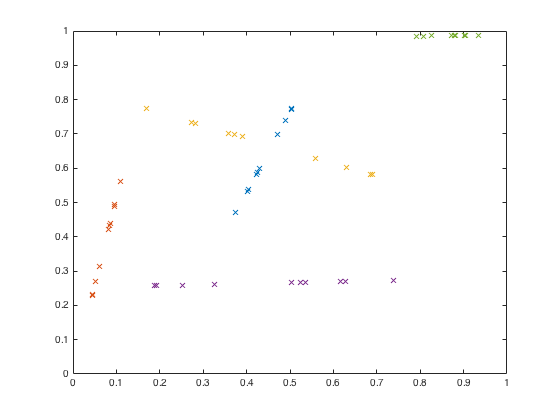
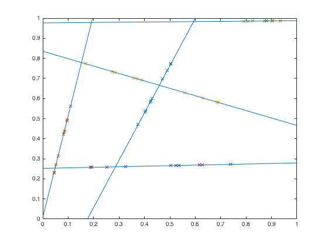
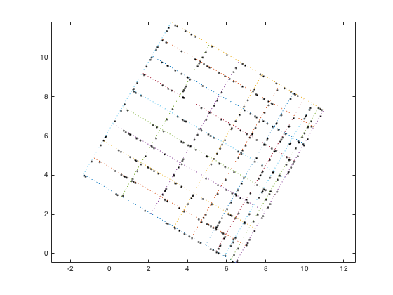
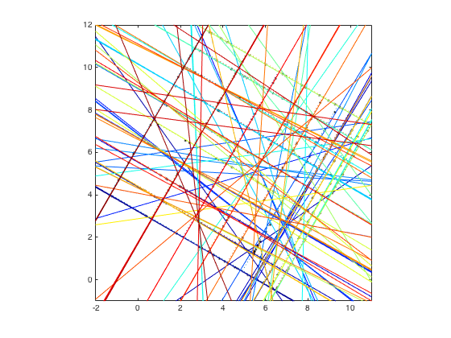

## colinear.m 

Given a set of scattered points, this function determines whether any 
subsets of those points fall along a line.  It also includes options to
deal with small deviations for linearity.

### Syntax

```
[ind, p] = colinear(x, y, p1, v1, ...)
```

See function help for full description of input and output variables.

### Examples


#### Simple colinear points

The default parameters allow you to find any set of 4 or more colinear 
points (or very close to colinear... by default, this function allows for 
a tolerance of 1e-5 on the angle between points, simply to account for 
floating point issues).  Our first example starts with points along 5
prescribed lines:

```matlab
x = rand(2,5);
y = rand(2,5);

xypt = interp1([0 1], cat(3,x,y), rand(10,1));

figure;
plot(xypt(:,:,1), xypt(:,:,2), 'x');
set(gca, 'xlim', [0 1], 'ylim', [0 1]);
```



We can find these lines using the with the colinear defaults.

```matlab
[ind, p] = colinear(xypt(:,:,1),xypt(:,:,2));

hold on;
xln = [0 1];
hln = gobjects(length(ind),1);
for ii = 1:length(ind)
    yln = polyval(p(ii,:), xln);
    hln(ii) = line(xln, yln);
end
set(gca, 'xlim', [0 1], 'ylim', [0 1]);
```



#### Messy mostly-linear points

For a more complex problem, let's extract a slightly-irregular grid. We'll start
with a set of points randomly distributed along the lines of a
rotated grid, with a bit of error in each point's coordinates.

```matlab
xg = 1:10;
yg = logspace(log10(1), log10(10), 10);

xend = [[xg; xg] [1;10]*ones(1,10)];
yend = [[1;10]*ones(1,10) [yg;yg]];

nline = size(xend,2);

npt = 20;
xypt = rand(npt,2,nline);
for ii = 1:nline
    xypt(:,:,ii) = interp1([0 1], [xend(:,ii) yend(:,ii)], rand(npt,1));
end 
xypt = reshape(permute(xypt, [1 3 2]), [], 2);
err = rand(size(xypt))*0.02 - 0.05;
xypt = xypt + err;

th = pi/3;
center = [5;5];
R = [cos(th) -sin(th); sin(th) cos(th)];

cent = ones(size(xypt'))*5;
xy = R*(xypt' - cent) + cent;
cent = ones(2,numel(xend))*5;
xyg = R*([xend(:) yend(:)]' - cent) + cent;
xg = reshape(xyg(1,:), size(xend));
yg = reshape(xyg(2,:), size(yend));

figure
plot(xg,yg,':');
hold on;
plot(xy(1,:), xy(2,:), 'k.');
axis equal;
```



For our first attempt to extract the lines, let's consider any points
whose angle differ from each other by less than 1 degree.  We know there
are 10 points per line, so we can set that threshold as well.

```matlab
[ind, p] = colinear(xy(1,:),xy(2,:), 'round', 1, 'npt', 10);

cmap = jet(length(ind));

xln = [-2 11];
hln = gobjects(length(ind),1);
for ii = 1:length(ind)
    yln = polyval(p(ii,:), xln);
    hln(ii) = line(xln, yln);
end
set(hln, {'color'}, num2cell(cmap,2));
set(gca, 'xlim', [-2 11], 'ylim', [-1 12]);
```



Hmm... well, that wasn't really what we wanted.  In situations like this 
(dense, nearly-gridded sets of points), 
the various diagonals are more colinear than the lines we
actually want to extract, expecially since we allowed for a little wiggle
room in the definition of "colinear."  In these cases, adding a little a
priori information about the orientation of our desired lines can help.
We know our grid lies along the 60/150 degree orientation, so we can use
the theta-limitation function to only look for lines within 1 degrees of
this orientation.

```matlab
[ind, p] = colinear(xy(1,:),xy(2,:), 'round', 0.5, ...
    'thlim', @(x) abs(x-60)<1 | abs(x+30)<1, 'npt', 10);

delete(hln);
hln = gobjects(length(ind),1);

cmap = jet(length(ind));

xln = [-2 11];
for ii = 1:length(ind)
    yln = polyval(p(ii,:), xln);
    hln(ii) = line(xln, yln);
end
set(hln, {'color'}, num2cell(cmap,2));
set(gca, 'xlim', [-2 11], 'ylim', [-1 12]);
```


At this point, some manual fiddling with the rounding tolerance may be
necessary to get all the lines, without adding in extras.  Lowering the
rounding tolerance can sometimes help, since the points in a line must be
within that tolerance of each other but not within that tolerance of any
other points.

